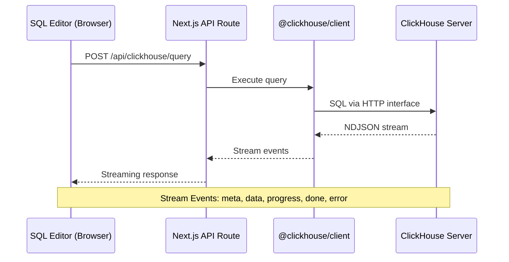
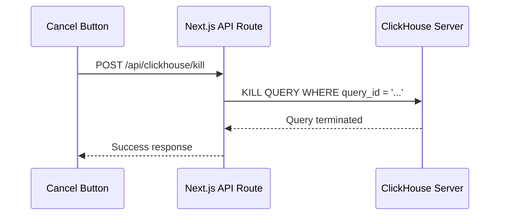

# Architecture

This document describes the technical architecture of ClickLens for developers and contributors.

import { Callout } from "nextra/components";


## 1. Tech Stack

| Layer                 | Technology                | Version   |
| --------------------- | ------------------------- | --------- |
| **Framework**         | Next.js (App Router)      | 16.1.1    |
| **Runtime**           | Bun (dev), Node.js (prod) | 20.x      |
| **UI Library**        | React                     | 19.2.3    |
| **Styling**           | Tailwind CSS              | 4.x       |
| **ClickHouse Client** | @clickhouse/client (HTTP) | 1.15.0    |
| **State Management**  | Zustand                   | 5.0.9     |
| **Session**           | iron-session              | 8.0.4     |
| **Forms**             | React Hook Form + Zod     | 7.x / 4.x |
| **Tables**            | TanStack React Table      | 8.21.3    |
| **Charts**            | Recharts                  | 3.6.0     |
| **Editor**            | CodeMirror 6              | 6.x       |

## 2. Project Structure

```
src/
├── app/                    # Next.js App Router
│   ├── (app)/              # Authenticated routes (9 route groups)
│   │   ├── discover/       # Discover feature
│   │   ├── sql/            # SQL Console
│   │   ├── tables/         # Table Explorer
│   │   ├── monitoring/     # 8 monitoring sub-pages
│   │   ├── queries/        # Query analytics (4 views)
│   │   ├── logging/        # Logging (3 views)
│   │   ├── access/         # User/role management
│   │   ├── settings/       # Settings viewer
│   │   └── profile/        # User profile
│   ├── api/                # API routes (41 endpoints)
│   │   ├── auth/           # Authentication (5 endpoints)
│   │   ├── clickhouse/     # ClickHouse operations (35+ endpoints)
│   │   └── saved-queries/  # Saved queries CRUD
│   └── login/              # Public login page
├── components/             # React components (80 files)
│   ├── auth/               # AuthProvider, useAuth hook
│   ├── discover/           # Discover feature components
│   ├── layout/             # Sidebar, Header
│   ├── logging/            # Log viewers
│   ├── monitoring/         # Monitoring tabs
│   ├── queries/            # Query analytics components
│   ├── sql/                # SQL Console components
│   ├── tables/             # Table explorer tabs
│   └── ui/                 # shadcn/ui primitives (30 components)
└── lib/                    # Core libraries (31 files)
    ├── auth/               # Session management
    ├── clickhouse/         # ClickHouse client & config
    ├── hooks/              # Custom React hooks (6)
    ├── rbac/               # Feature roles
    ├── store/              # Zustand stores (3)
    ├── types/              # TypeScript definitions
    └── sql/                # SQL parsing utilities
```

## 3. Data Flow

### 3.1. Query Execution (NDJSON Streaming)

ClickLens uses a streaming architecture for query execution to handle large result sets efficiently:



**Stream Events (NDJSON):**

| Event Type | Description                      |
| ---------- | -------------------------------- |
| `meta`     | Column names and types           |
| `data`     | Batches of result rows           |
| `progress` | Rows read, bytes processed       |
| `done`     | Query complete, final statistics |
| `error`    | Error details if query failed    |

**Client-Side Processing:**

1. Parse NDJSON lines as they arrive
2. Throttle UI updates to every 200ms (performance optimization)
3. Accumulate rows in component state
4. Display progress while streaming

### 3.2. Query Cancellation



Each query is assigned a UUID (`query_id`) which enables cancellation via ClickHouse's `KILL QUERY` command.

## 4. State Management

ClickLens uses Zustand for client-side state, split into three stores:

### 4.1. `useTabsStore` (Persisted)

**File:** `src/lib/store/tabs.ts`

Manages SQL Console tabs and query history. Persisted to `localStorage`.

```typescript
interface TabsState {
  tabs: Tab[]; // Query and table tabs
  activeTabId: string; // Currently active tab
  history: QueryHistoryEntry[]; // Last 100 queries
}
```

**Persistence Strategy:**

- Tabs are saved without `result` data (too large)
- History entries include: SQL, duration, rows, bytes, memory, user, error
- Maximum 100 history entries retained

### 4.2. `useSqlBrowserStore` (Transient)

**File:** `src/lib/store/sql-browser.ts`

Manages database/table browsing state. Not persisted.

```typescript
interface SqlBrowserState {
  databases: string[];
  selectedDatabase: string | null;
  tables: TableInfo[];
  tablesCache: Record<string, TableInfo[]>;
  columnsCache: Record<string, ColumnsCacheEntry>;
  // ... actions
}
```

**Caching Strategy:**

- Tables are preloaded for all databases on mount
- Columns have a 5-minute TTL cache
- Cache keys use `database.table` format

### 4.3. `useAccessStore` (Transient)

**File:** `src/lib/store/access.ts`

Manages access control UI state. Not persisted.

## 5. Authentication & Session

### 5.1. Session Management

ClickLens uses `iron-session` for secure, encrypted cookie-based sessions.

**Configuration:**

- Cookie name: `clicklens-session`
- TTL: 7 days
- Encryption: iron-session's built-in encryption using `SESSION_SECRET`

**Session Data:**

```typescript
interface SessionData {
  isLoggedIn: boolean;
  user?: {
    username: string;
    password: string; // Encrypted in cookie
    host?: string;
    database?: string;
  };
}
```

<Callout type="warning">
  User credentials are stored in the encrypted session cookie. The
  `SESSION_SECRET` environment variable MUST be at least 32 characters for
  security.
</Callout>

### 5.2. Permission Derivation

Permissions are **not stored**—they're derived from ClickHouse grants at login time.

**How it works:**

1. User logs in with ClickHouse credentials
2. ClickLens queries `system.grants` for the user's privileges
3. Privileges are mapped to UI permissions:

| ClickHouse Grant               | UI Permission        |
| ------------------------------ | -------------------- |
| `ACCESS MANAGEMENT`            | `canManageUsers`     |
| `SELECT ON system.processes`   | `canViewProcesses`   |
| `KILL QUERY`                   | `canKillQueries`     |
| `SELECT ON system.clusters`    | `canViewCluster`     |
| `SHOW TABLES`                  | `canBrowseTables`    |
| `SELECT ON *.*`                | `canExecuteQueries`  |
| `SHOW TABLES + SELECT`         | `canDiscover`        |
| `SELECT ON system.settings`    | `canViewSettings`    |
| `SELECT ON system.text_log`    | `canViewSystemLogs`  |
| `SELECT ON system.session_log` | `canViewSessionLogs` |
| `SELECT ON system.crash_log`   | `canViewCrashLogs`   |

4. Permissions are cached in client-side AuthContext
5. UI components use `useAuth()` hook to check permissions

### 5.3. AuthProvider

**File:** `src/components/auth/AuthProvider.tsx`

The `AuthProvider` component wraps the entire app and:

- Fetches session on mount
- Derives permissions from ClickHouse grants
- Provides `login()`, `logout()`, `refresh()` functions
- Redirects to `/login` if unauthenticated

## 6. ClickHouse Client

### 6.1. Dual Client Model

ClickLens uses two types of ClickHouse connections:

**1. Lens Client (Service Account)**

- Credentials from environment (`LENS_USER`, `LENS_PASSWORD`)
- Used for metadata queries, schema introspection
- Has read access to `system.*` tables

**2. User Client (Session Credentials)**

- Credentials from user session
- Used for all user-initiated queries
- Permissions reflect the user's ClickHouse grants

### 6.2. Configuration

**File:** `src/lib/clickhouse/config.ts`

```typescript
interface ClickHouseConfig {
  host: string;
  port: number;
  secure: boolean; // Use HTTPS
  verifySsl: boolean; // Verify SSL certificate
  username: string;
  password: string;
  database: string;
}
```

### 6.3. HTTP Interface

ClickLens uses the ClickHouse HTTP interface exclusively:

- Port 8123 (HTTP) or 8443 (HTTPS)
- Custom headers: `X-ClickHouse-User`, `X-ClickHouse-Key`, `X-ClickHouse-Database`
- Native TCP protocol (9000/9440) is NOT supported

## 7. Custom Hooks

| Hook                 | File                      | Purpose                         |
| -------------------- | ------------------------- | ------------------------------- |
| `useIncrementalData` | `use-incremental-data.ts` | Polling with diff-based updates |
| `useLogs`            | `use-logs.ts`             | Log fetching with filtering     |
| `useMonitoring`      | `use-monitoring.ts`       | Auto-refreshing monitoring data |
| `useQueryAnalytics`  | `use-query-analytics.ts`  | Query performance aggregation   |
| `useSettings`        | `use-settings.ts`         | Settings management             |
| `useTableExplorer`   | `use-table-explorer.ts`   | Table browsing state            |

## 8. UI Component Library

ClickLens uses shadcn/ui patterns with Radix UI primitives:

- **30 base components** in `src/components/ui/`
- **Styling**: `class-variance-authority` for variants
- **Animation**: `tw-animate-css` for Tailwind animations

**Custom UI Components:**

- `TruncatedCell` - Text truncation with tooltip
- `JsonViewer` - Collapsible JSON display
- `RecordDetailSheet` - Side panel for row details
- `AccessDenied` - Permission error display
