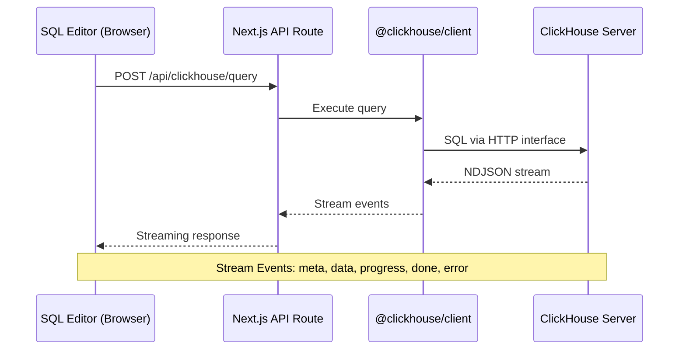
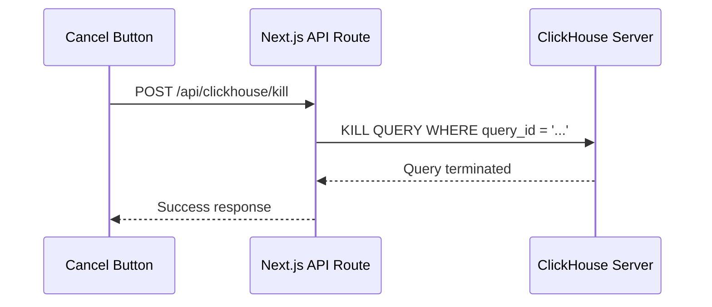

# Architecture

This document provides a comprehensive technical architecture overview of ClickLens for developers and contributors.

import { Callout } from "nextra/components";


## System Architecture Overview

ClickLens follows a layered architecture pattern with clear separation of concerns, enabling independent development and testing of each layer. The system is designed as a stateless web application that delegates all heavy lifting to ClickHouse while maintaining minimal server-side state.

### Architecture Layers

1. **Frontend Layer** (`src/app/(app)/` and `src/components/`): React Server and Client Components organized by feature module. State management via Zustand with selective localStorage persistence.

2. **API Layer** (`src/app/api/`): 41+ Next.js route handlers grouped by function (auth, clickhouse operations, access management). Handles authentication, permission checks, and ClickHouse query execution.

3. **Service Layer** (`src/lib/`): Core business logic including ClickHouse client management, RBAC derivation, monitoring queries, and SQL parsing utilities.

4. **External Layer**: ClickHouse cluster accessed exclusively via HTTP interface. System tables provide metadata, monitoring data, and security information.

### Key Architectural Decisions

- **Dual Client Model**: Separates privileged operations (via `LENS_USER`) from user-context queries (via session credentials)
- **Permission Derivation**: UI capabilities are computed from ClickHouse grants at login time, not stored separately
- **NDJSON Streaming**: Large query results stream incrementally to avoid memory exhaustion
- **Server Components First**: Next.js App Router with React Server Components for improved performance

## Technology Stack

ClickLens leverages modern web technologies optimized for performance and developer productivity.

| Layer | Technology | Version | Purpose |
| ----- | ---------- | ------- | ------- |
| **Framework** | Next.js (App Router) | 16.1.1 | Server-side rendering, API routes, file-based routing |
| **Runtime** | Bun (dev) / Node.js (prod) | 20.x | Fast development runtime, stable production runtime |
| **UI Library** | React | 19.2.3 | Component-based user interface |
| **Styling** | Tailwind CSS | 4.x | Utility-first CSS framework |
| **ClickHouse Client** | @clickhouse/client (HTTP) | 1.15.0 | Official ClickHouse JavaScript HTTP client |
| **State Management** | Zustand | 5.0.9 | Lightweight state management |
| **Session** | iron-session | 8.0.4 | Secure cookie-based sessions |
| **Forms** | React Hook Form + Zod | 7.x / 4.x | Form validation and management |
| **Tables** | TanStack React Table | 8.21.3 | Advanced data table component |
| **Charts** | Recharts | 3.6.0 | Data visualization |
| **Editor** | CodeMirror 6 | 6.x | SQL code editor with syntax highlighting |
| **Caching** | Redis | 6.x+ | Optional caching for improved performance |

## Application Structure

The application follows Next.js App Router conventions with route groups for logical organization.

### Directory Organization

```
src/
├── app/                    # Next.js App Router
│   ├── (app)/              # Authenticated route group (9 features)
│   │   ├── discover/       # Kibana-like data exploration
│   │   ├── sql/            # SQL Console with multi-tab support
│   │   ├── tables/         # Table Explorer with schema view
│   │   ├── monitoring/     # 8 monitoring sub-pages
│   │   ├── queries/        # Query analytics (4 views)
│   │   ├── logging/        # System logging (3 views)
│   │   ├── access/         # User and role management
│   │   ├── settings/       # Settings viewer
│   │   └── profile/        # User profile management
│   ├── api/                # API route handlers
│   │   ├── auth/           # Authentication (5 endpoints)
│   │   ├── clickhouse/     # ClickHouse operations (35+ endpoints)
│   │   └── saved-queries/  # Saved queries CRUD
│   └── login/              # Public login page
├── components/             # React components (80 files)
│   ├── auth/               # AuthProvider, useAuth hook
│   ├── discover/           # Discover feature components
│   ├── layout/             # Sidebar, Header, Shell
│   ├── logging/            # Log viewers and filters
│   ├── monitoring/         # Monitoring tabs and widgets
│   ├── queries/            # Query analytics components
│   ├── sql/                # SQL Console components
│   ├── tables/             # Table explorer components
│   └── ui/                 # shadcn/ui primitives (30 components)
└── lib/                    # Core business logic (31 files)
    ├── auth/               # Session management
    ├── clickhouse/         # ClickHouse client & config
    ├── hooks/              # Custom React hooks (6)
    ├── rbac/               # Feature roles and permissions
    ├── store/              # Zustand stores (3)
    ├── types/              # TypeScript definitions
    └── sql/                # SQL parsing utilities
```

### Feature Module Summary

| Module | Route | Components | API Endpoints | Permission Required |
| ------ | ----- | ---------- | ------------- | ------------------- |
| **Dashboard** | `/` | Feature cards, hero section | N/A | Any authenticated user |
| **Discover** | `/discover` | QueryBar, FieldsSidebar, DiscoverGrid, DiscoverHistogram | `/api/clickhouse/discover` | `canDiscover` |
| **SQL Console** | `/sql` | SqlEditor (CodeMirror), ResultGrid (TanStack Table), QueryTabs, QueryHistory, SavedQueries | `/api/clickhouse/query`, `/api/clickhouse/kill`, `/api/saved-queries/*` | `canExecuteQueries` |
| **Table Explorer** | `/tables` | 8 tab components (overview, columns, parts, merges, mutations, replicas, dependencies, DDL) | `/api/clickhouse/tables/explorer/*` (7 endpoints) | `canBrowseTables` |
| **Monitoring** | `/monitoring/*` | 8 specialized dashboards | `/api/clickhouse/monitoring/*` (8 endpoints) | `canViewCluster` |
| **Queries** | `/queries/*` | 4 views (running, history, analytics, cache) | `/api/clickhouse/queries/*` (4 endpoints) | `canViewProcesses` |
| **Logging** | `/logging/*` | 3 log viewers | `/api/clickhouse/logging/*` (3 endpoints) | `canViewServerLogs`, `canViewSessionLogs`, `canViewCrashLogs` |
| **Access** | `/access/*` | User management, role management | `/api/clickhouse/access/*` (12 endpoints) | `canManageUsers` |
| **Settings** | `/settings/*` | Server settings viewer, session settings viewer | `/api/clickhouse/settings/*` (2 endpoints) | `canViewSettings` |

## Core Architectural Patterns

### Dual Client Model

ClickLens employs a sophisticated dual-client architecture that separates metadata operations from user queries, ensuring both security and performance.

#### Lens Client (Service Account)

- **Credentials**: From environment variables (`LENS_USER`, `LENS_PASSWORD`)
- **Purpose**: Read-only metadata and monitoring operations that don't require user context
- **Used By**: Permission derivation, schema introspection, monitoring dashboards, cluster topology
- **Required Grants**: `SELECT ON system.*`, `SHOW DATABASES`, `SHOW TABLES`, `ACCESS MANAGEMENT` (for reading grants)

#### User Client (Session Credentials)

- **Credentials**: From user session (encrypted in cookie)
- **Purpose**: Execute user-initiated queries with their actual ClickHouse permissions
- **Used By**: SQL Console, Discover, Table Explorer (for data preview)
- **Permissions**: Exactly what the user has in ClickHouse (SELECT, INSERT, CREATE, etc.)
- **Audit Trail**: Queries appear in `system.query_log` with the user's username

#### When Each Client is Used

| Operation | Client Type | Reason |
| --------- | ----------- | ------ |
| Execute user SQL query | User Client | Enforce user's actual permissions, audit as user |
| Discover feature (data) | User Client | User must have SELECT on table |
| Derive permissions at login | Lens Client | Need to query `system.grants` for any user |
| Fetch database/table list | Lens Client | Consistent metadata regardless of user permissions |
| Monitoring dashboards | Lens Client | Need consistent `system.*` access for all users |
| Query history from `system.query_log` | Lens Client | Users may not have SELECT on system tables |
| Kill running query | User Client | User must have `KILL QUERY` grant |
| User/role management | User Client | User must have `ACCESS MANAGEMENT` grant |

### State Management Architecture

ClickLens uses Zustand for client-side state management, organized into three distinct stores with different persistence strategies.

#### useTabsStore (Persisted)

**Purpose**: Manage SQL Console tabs and query history

**Persistence**: localStorage (key: `clicklens-tabs-storage`)

**State**:
- `tabs`: Array of query and table tabs
- `activeTabId`: Currently active tab
- `history`: Last 100 query history entries

**Persistence Strategy**:
- Tabs are saved without `result` data (too large for localStorage)
- History entries include: SQL, duration, rows, bytes, memory, user, error
- Maximum 100 history entries retained (oldest pruned)

#### useSqlBrowserStore (Transient)

**Purpose**: Cache database/table metadata for SQL Console and Discover

**Persistence**: None (in-memory only)

**State**:
- `databases`: List of available databases
- `selectedDatabase`: Currently selected database
- `tables`: Table information
- `tablesCache`: Cached table lists per database
- `columnsCache`: Cached column information with TTL

**Caching Strategy**:
- Tables are preloaded for all databases on mount
- Columns have a 5-minute TTL cache
- Cache keys use `database.table` format

#### useAccessStore (Transient)

**Purpose**: Manage Access Control UI state (user/role editing)

**Persistence**: None (transient state)

**State**:
- Editing state for users and roles
- Form data for create/edit operations

## Data Flow Architecture

### Query Execution Pipeline (NDJSON Streaming)

ClickLens implements a streaming query execution model that efficiently handles large result sets without blocking the UI or consuming excessive memory.


```mermaid
sequenceDiagram
    participant Browser as SQL Editor (Browser)
    participant API as Next.js API Route
    participant Client as @clickhouse/client
    participant CH as ClickHouse Server

    Browser->>API: POST /api/clickhouse/query
    API->>Client: Execute query
    Client->>CH: SQL via HTTP interface
    CH-->>Client: NDJSON stream
    Client-->>API: Stream events
    API-->>Browser: Streaming response

    Note over Browser,CH: Stream Events: meta, data, progress, done, error
```

**Stream Events (NDJSON Format)**:

| Event Type | Description |
| ---------- | ----------- |
| `meta` | Column names and types |
| `data` | Batches of result rows |
| `progress` | Rows read, bytes processed |
| `done` | Query complete with final statistics |
| `error` | Error details if query fails |

**Client-Side Processing**:

1. Parse NDJSON lines as they arrive
2. Throttle UI updates to every 200ms (performance optimization)
3. Accumulate rows in component state
4. Display progress while streaming

### Query Cancellation Flow


```mermaid
sequenceDiagram
    participant Browser as Cancel Button
    participant API as Next.js API Route
    participant CH as ClickHouse Server

    Browser->>API: POST /api/clickhouse/kill
    API->>CH: KILL QUERY WHERE query_id = '...'
    CH-->>API: Query terminated
    API-->>Browser: Success response
```

Each query is assigned a UUID (`query_id`) which enables cancellation via ClickHouse's `KILL QUERY` command.

## Authentication & Authorization Architecture

ClickLens implements a sophisticated permission derivation model that leverages ClickHouse's native RBAC system, eliminating the need for separate permission storage or synchronization.

### Session Management

**Session Library**: iron-session

**Configuration**:
- Cookie Name: `clicklens-session`
- Encryption: AES-256-GCM via iron-session
- TTL: 24 hours
- Storage: Encrypted cookie (credentials never exposed to browser)
- Secret Key: `SESSION_SECRET` environment variable (minimum 32 characters)

**Session Data Structure**:

```typescript
interface SessionData {
  isLoggedIn: boolean;
  sessionId?: string;
  user?: {
    username: string;
    password: string;  // Encrypted in cookie
    host?: string;
    database?: string;
  };
}
```

<Callout type="warning">
  User credentials are encrypted server-side and stored in the session cookie.
  They are **never** exposed to the client browser. The `SESSION_SECRET`
  environment variable MUST be at least 32 characters for secure encryption.
</Callout>

### Permission Derivation Model

Permissions are not stored in ClickLens—they are dynamically derived from ClickHouse grants at login time. This ensures permissions always reflect the current ClickHouse state without synchronization complexity.

**Derivation Process**:

1. User logs in with ClickHouse credentials
2. ClickLens queries `system.grants` for user privileges (via Lens Client)
3. If no rows (XML-configured users), fall back to `SHOW GRANTS` (via User Client)
4. Execute probe queries to verify access (e.g., `SELECT 1 FROM system.processes LIMIT 1`)
5. Map native ClickHouse grants to 13 UI permission flags
6. Permissions are cached in client-side AuthContext
7. UI components use `useAuth()` hook to check permissions

**Grant-to-Permission Mapping**:

| ClickHouse Grant | UI Permission | Feature Enabled |
| ---------------- | ------------- | --------------- |
| `ACCESS MANAGEMENT` | `canManageUsers` | User/Role Management |
| `SELECT ON system.processes` | `canViewProcesses` | Query Monitoring |
| `KILL QUERY` | `canKillQueries` | Query Termination |
| `SHOW TABLES` | `canBrowseTables` | Table Explorer |
| `SELECT ON *.*` | `canExecuteQueries` | SQL Console |
| `SHOW TABLES + SELECT` | `canDiscover` | Discover Feature |
| `SELECT ON system.clusters` | `canViewCluster` | Cluster Monitoring |
| `SELECT ON system.settings` | `canViewSettings` | Settings Module |
| `SELECT ON system.text_log` | `canViewServerLogs` | Server Logs Tab |
| `SELECT ON system.session_log` | `canViewSessionLogs` | Session Logs Tab |
| `SELECT ON system.crash_log` | `canViewCrashLogs` | Crash Logs Tab |

**Feature Roles**: ClickLens defines 6 predefined ClickHouse roles prefixed with `clicklens_*` that bundle common permission sets.

| Feature Role | Purpose | Required Grants |
| ------------ | ------- | --------------- |
| `clicklens_table_explorer` | Browse schemas | `SHOW DATABASES`, `SHOW TABLES`, `SELECT ON system.{tables,columns,parts,replicas,mutations,merges}` |
| `clicklens_query_monitor` | Monitor queries | `KILL QUERY`, `SELECT ON system.{processes,query_log,query_cache}` |
| `clicklens_cluster_monitor` | Monitor cluster | `SELECT ON system.{clusters,replicas,metrics,events,disks,replication_queue,asynchronous_metrics}` |
| `clicklens_user_admin` | Manage users/roles | `ACCESS MANAGEMENT ON *.*` |
| `clicklens_table_admin` | DDL operations | `TRUNCATE`, `OPTIMIZE ON *.*` |
| `clicklens_settings_admin` | View configuration | `SELECT ON system.{settings,server_settings}` |

<Callout type="info">
  **XML-Configured Users (e.g., default user):** Some users receive access via
  `users.xml` instead of SQL grants. Since these privileges don't appear in
  `system.grants`, ClickLens intelligently falls back to user-credential probes
  (running `SHOW GRANTS` and probing `system.tables` with the user's
  credentials) to accurately determine access.
</Callout>

## Component Architecture

ClickLens follows a hierarchical component structure with clear separation between UI primitives and feature-specific components.

### Component Hierarchy

```
App (Root)
├── AuthProvider (wraps entire app)
│   └── Provides authentication context
├── Layout (src/app/layout.tsx)
│   └── Global layout with providers
└── (app) Route Group
    ├── Shell Layout (src/app/(app)/layout.tsx)
    │   ├── Sidebar (navigation)
    │   ├── Header (top bar)
    │   └── Connection Status
    └── Feature Pages
        ├── Dashboard
        ├── Discover
        ├── SQL Console
        ├── Table Explorer
        ├── Monitoring (8 tabs)
        ├── Queries (4 views)
        ├── Logging (3 views)
        ├── Access (2 views)
        ├── Settings (2 views)
        └── Profile
```

### Custom Hooks Architecture

The application uses six custom hooks to encapsulate complex logic and provide clean interfaces to components.

| Hook | File | Purpose |
| ---- | ---- | ------- |
| `useIncrementalData` | `use-incremental-data.ts` | Polling with diff-based updates |
| `useLogs` | `use-logs.ts` | Log fetching with filtering |
| `useMonitoring` | `use-monitoring.ts` | Auto-refreshing monitoring data |
| `useQueryAnalytics` | `use-query-analytics.ts` | Query performance aggregation |
| `useSettings` | `use-settings.ts` | Settings management |
| `useTableExplorer` | `use-table-explorer.ts` | Table browsing state |

## API Architecture

ClickLens exposes 41+ API endpoints organized by functional area. All endpoints follow REST conventions and return JSON responses (except streaming query endpoint which returns NDJSON).

### API Endpoint Groups

**Authentication** (`/api/auth/`):
- `/api/auth/login` - Authenticate user, create session
- `/api/auth/logout` - Destroy session
- `/api/auth/session` - Get current session data
- `/api/auth/permissions` - Derive UI permissions from grants
- `/api/auth/password` - Change user password

**Query Execution** (`/api/clickhouse/`):
- `/api/clickhouse/query` - Execute SQL with NDJSON streaming
- `/api/clickhouse/kill` - Kill running query by query_id
- `/api/clickhouse/ping` - Health check

**Schema & Metadata** (`/api/clickhouse/`):
- `/api/clickhouse/databases` - List databases
- `/api/clickhouse/tables` - List tables
- `/api/clickhouse/schema/columns` - Get column metadata for autocomplete
- `/api/clickhouse/schema/table-columns` - Get table columns with types

**Table Explorer** (`/api/clickhouse/tables/explorer/`):
- `/api/clickhouse/tables/explorer` - Table list with engine info
- `/api/clickhouse/tables/explorer/columns` - Column definitions
- `/api/clickhouse/tables/explorer/parts` - Data parts
- `/api/clickhouse/tables/explorer/merges` - Active merges
- `/api/clickhouse/tables/explorer/mutations` - Pending mutations
- `/api/clickhouse/tables/explorer/replicas` - Replica status
- `/api/clickhouse/tables/explorer/dependencies` - Table dependency graph
- `/api/clickhouse/tables/explorer/ddl` - CREATE TABLE statement

**Monitoring** (`/api/clickhouse/monitoring/`):
- `/api/clickhouse/monitoring/overview` - Dashboard metrics
- `/api/clickhouse/monitoring/dashboard` - Time-series charts
- `/api/clickhouse/monitoring/metrics` - Current metrics
- `/api/clickhouse/monitoring/cluster` - Cluster topology
- `/api/clickhouse/monitoring/health` - Health checks
- `/api/clickhouse/monitoring/disks` - Disk usage
- `/api/clickhouse/monitoring/keeper` - Keeper status
- `/api/clickhouse/monitoring/operations` - Merges/mutations

**Query Analytics** (`/api/clickhouse/queries/`):
- `/api/clickhouse/queries/running` - Active queries (system.processes)
- `/api/clickhouse/queries/history` - Query log (system.query_log)
- `/api/clickhouse/queries/analytics` - Top resource-consuming queries
- `/api/clickhouse/queries/cache` - Query cache statistics

**Access Management** (`/api/clickhouse/access/`):
- `/api/clickhouse/access/users` - List/create users
- `/api/clickhouse/access/users/[id]` - Update/delete user
- `/api/clickhouse/access/roles` - List/create roles
- `/api/clickhouse/access/roles/[id]` - Update/delete role

**Discover Feature** (`/api/clickhouse/`):
- `/api/clickhouse/discover` - Data or histogram query

**Logging** (`/api/clickhouse/logging/`):
- `/api/clickhouse/logging/server` - Server logs (system.text_log)
- `/api/clickhouse/logging/session` - Session logs (system.session_log)
- `/api/clickhouse/logging/crash` - Crash logs (system.crash_log)

**Settings** (`/api/clickhouse/settings/`):
- `/api/clickhouse/settings/server` - Server settings (system.server_settings)
- `/api/clickhouse/settings/session` - Session settings (system.settings)

### API Patterns and Conventions

**Error Handling**: All endpoints return `{ success: boolean, error?: string, data?: any }` format. HTTP status codes: 200 (success), 401 (unauthorized), 403 (forbidden), 500 (server error).

**Authentication**: All `/api/clickhouse/*` endpoints check session via `getSessionClickHouseConfig()`. Returns 401 if not logged in.

**Permission Checks**: Endpoints that require specific permissions check them via the User Client (e.g., attempting `KILL QUERY` will fail if user lacks the grant).

**Client Selection**:
- User-initiated queries: User Client
- Metadata/monitoring: Lens Client
- Access management: User Client (requires `ACCESS MANAGEMENT`)

## Security Architecture

ClickLens implements defense-in-depth security through multiple layers.

### Application Security

1. **Session Encryption**: All session data encrypted with iron-session (AES-256-GCM)
2. **Permission Derivation**: Direct mapping from ClickHouse grants, no permission storage
3. **Input Validation**: Zod schemas for all API inputs
4. **Rate Limiting**: Built-in rate limiting for authentication endpoints
5. **Security Headers**: Next.js configured with strict security policies

### Network Security

1. **HTTPS Support**: Optional SSL/TLS for ClickHouse connections
2. **Cookie Security**: Secure, HttpOnly cookies in production
3. **CSRF Protection**: SameSite cookie policies and explicit Double-Submit Cookie token (`x-csrf-token` header) for state-mutating API routes
4. **CORS Control**: Configured API access policies

## Error Handling Architecture

ClickLens implements centralized error handling through `@/lib/errors` to provide consistent, user-friendly error messages while maintaining security.

### Error Categorization

All ClickHouse errors are categorized into specific types for appropriate handling and user feedback.

| Error Type | Description | User Experience |
| ---------- | ----------- | --------------- |
| **SYNTAX** | Invalid SQL syntax, typos, malformed queries | Shows syntax error with line/column information and suggestion |
| **SCHEMA** | Table/database not found, column doesn't exist | Lists available tables/columns, suggests similar names |
| **PERMISSION** | User lacks required grants for operation | Explains required permission, suggests contacting admin |
| **TIMEOUT** | Query exceeded execution time limit | Shows timeout duration, suggests optimizing query |
| **NETWORK** | Connection issues, ClickHouse unreachable | Displays connection status, retry option |
| **SYSTEM** | ClickHouse internal errors, resource limits | Shows system error details, suggests checking cluster health |

### Error Response Format

All API errors follow a consistent structure:

```typescript
{
  success: false;
  error: {
    code: number;           // HTTP status or error code
    type: string;           // "SYNTAX", "SCHEMA", "PERMISSION", etc.
    message: string;        // Technical details (sanitized in production)
    userMessage: string;    // User-friendly explanation
    hint?: string;          // Optional actionable suggestion
  };
}
```

### Security Considerations

- **Production Sanitization**: File paths, IP addresses, credentials, and stack traces are removed from error responses
- **Server-Side Logging**: Full error details logged server-side for debugging
- **User-Friendly Messages**: Technical errors translated to actionable guidance
- **Hint System**: Contextual suggestions help users resolve issues independently

### Usage Pattern

```typescript
import { formatQueryError } from "@/lib/errors";

try {
  const result = await clickHouseClient.query({ query: sql });
  return result;
} catch (error) {
  const formatted = formatQueryError(error, undefined, true);
  return NextResponse.json(
    { success: false, error: formatted },
    { status: 500 },
  );
}
```

## Performance Optimizations

ClickLens incorporates several performance optimizations to ensure responsiveness even with large datasets.

1. **NDJSON Streaming**: Incremental result rendering
2. **Column Caching**: 5-minute TTL for schema information
3. **Throttled Updates**: 200ms throttle during streaming
4. **Virtualization**: Virtual scrolling for large tables
5. **Code Splitting**: Automatic route-based code splitting
6. **Standalone Build**: Optimized serverless deployment
7. **Query Timeout Enforcement**: Prevents runaway queries (default 60s, max 300s)
8. **Metadata Caching**: Table schemas and column information cached to reduce database load

#### Virtualized Components

ClickLens implements virtualized rendering for large datasets to maintain smooth performance even with millions of rows.

| Component | Location | Purpose | Key Features |
| --------- | -------- | ------- | ------------ |
| **VirtualizedResultGrid** | `src/components/sql/VirtualizedResultGrid.tsx` | SQL Console query results | Windowed rendering, dynamic row heights, smooth scrolling, column resizing, row selection |
| **VirtualizedDiscoverGrid** | `src/components/discover/VirtualizedDiscoverGrid.tsx` | Discover feature data exploration | Same features as ResultGrid, optimized for time-series data with expandable rows |

**Technical Implementation**:
- Uses TanStack Table with virtualization plugin
- Renders only visible rows (typically 20-50) regardless of total dataset size
- Maintains scroll position and selection state efficiently
- Supports dynamic row heights for expandable content
- Implements column resizing with persisted preferences

## Deployment Architecture

ClickLens is designed for containerized deployment with a multi-stage Docker build optimized for production environments.

### Docker Build Stages

**Build Optimizations**:
- Multi-stage build for minimal image size
- Standalone output for optimal startup
- Runtime environment variables
- Session secret provided at runtime (not build time)

### Environment Configuration

The application requires minimal configuration through environment variables:

**Required**:
- `CLICKHOUSE_HOST` - ClickHouse server address
- `LENS_USER` - Service account username
- `LENS_PASSWORD` - Service account password
- `SESSION_SECRET` - Session encryption key (min 32 chars)

**Optional**:
- `CLICKHOUSE_PORT` - Default: `8123`
- `CLICKHOUSE_SECURE` - Default: `false`
- `CLICKHOUSE_VERIFY` - Default: `true`
- `NODE_ENV` - Default: `development`
- `DISABLE_SECURE_COOKIES` - Default: `false`
- `REDIS_URL` - Redis connection URL for caching (e.g., `redis://localhost:6379`)

### Caching Architecture

ClickLens supports optional Redis caching to improve performance for frequently accessed data.

#### Redis Integration

**Purpose**: Cache query results and monitoring metrics to reduce ClickHouse load and improve response times.

**Cached Data Types**:
- Table Explorer data (schema information, parts, merges, mutations)
- Monitoring metrics (system.metrics, system.asynchronous_metrics)
- Query analytics data
- Time-series chart data

**Cache Strategy**: Stale-while-revalidate pattern
- Serve cached data immediately
- Refresh cache in background
- Reduces perceived latency for users

**Configuration**:
- Redis is optional - if `REDIS_URL` is not set, caching is disabled
- Connection string format: `redis://[password@]host:port[/db]`
- Example: `redis://localhost:6379` or `redis://:password@redis.example.com:6379/0`

**Cache Key Patterns**:

| Data Type | Key Pattern | TTL |
| --------- | ----------- | --- |
| Table schema | `clicklens:schema:{database}:{table}` | 5 minutes |
| Table parts | `clicklens:parts:{database}:{table}` | 1 minute |
| Monitoring metrics | `clicklens:metrics:{metric_name}` | 30 seconds |
| Query analytics | `clicklens:analytics:{time_range}` | 1 minute |
| Time-series data | `clicklens:timeseries:{metric}:{start}:{end}` | 2 minutes |

**Cache Invalidation Strategies**:

| Strategy | Description | Use Case |
| --------- | ----------- | -------- |
| **TTL-based** | Automatic expiration after configured time-to-live | Most monitoring data, schema information |
| **Event-driven** | Invalidate on specific events (e.g., table DDL) | Table Explorer data after schema changes |
| **Pattern-based** | Bulk invalidation using key patterns | Clear all monitoring data on cluster restart |
| **Selective** | Manual invalidation via API endpoints | Force refresh after data updates |

**Benefits**:
- Reduced ClickHouse query load
- Faster page loads for monitoring dashboards
- Better user experience with instant data display
- Lower resource consumption on ClickHouse server

<Callout type="info">
  Redis caching is completely optional. ClickLens functions normally without Redis,
  but enabling it significantly improves performance for monitoring and table
  browsing features.
</Callout>

### ClickHouse Requirements

**Minimum Version**: 21.8+

**Required Server Configuration** (`config.xml`):
- HTTP interface enabled (port 8123 or 8443)
- Access management improvements enabled

**Optional System Tables** (enable in `config.xml`):
- `system.text_log` - Server logs viewer
- `system.session_log` - Session logs viewer
- `system.metric_log` - Time-series monitoring charts

**Lens Service Account Setup**:
- Create user with `LENS_USER` and `LENS_PASSWORD`
- Grant `SELECT ON system.*`
- Grant `SHOW DATABASES`, `SHOW TABLES`, `SHOW COLUMNS`
- Grant `ACCESS MANAGEMENT` (for reading grants)