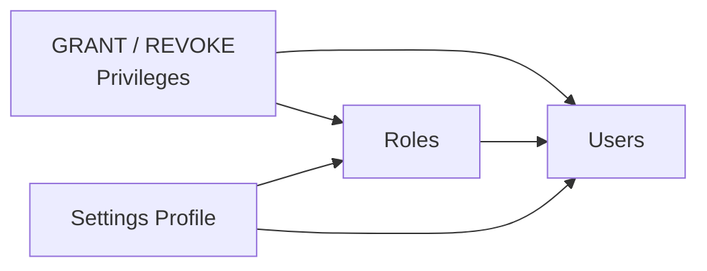
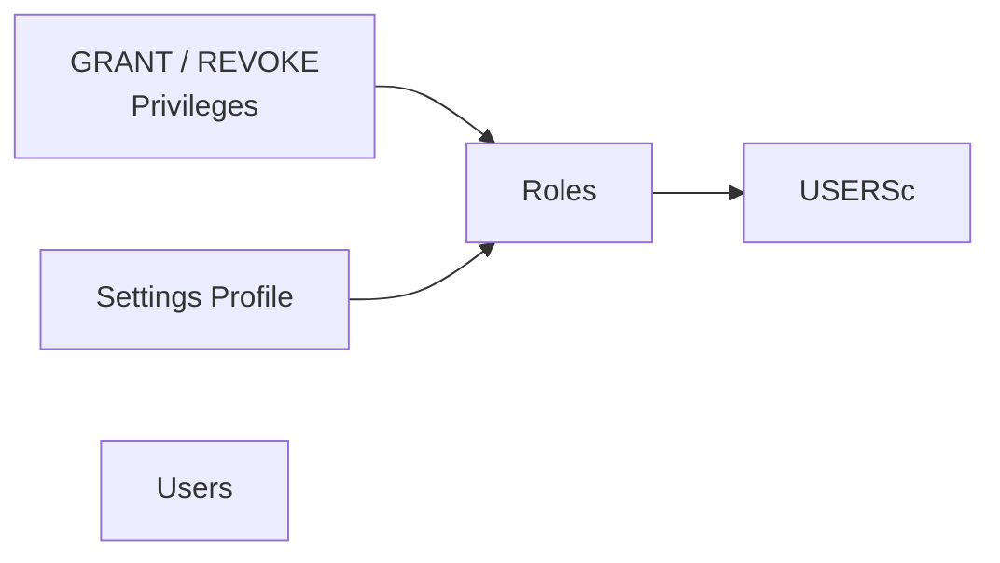

# Features

ClickLens provides a comprehensive suite of tools for managing and monitoring ClickHouse databases. This guide covers all major features and how to use them.

import { Callout } from "nextra/components";

## 1. Discover (Kibana-like Data Exploration)

The **Discover** feature provides a flexible, Kibana-style interface for exploring data in any ClickHouse table—not just logs.

<Callout type="info">
  **Requires `canDiscover` permission.** This permission is derived from having
  `SHOW TABLES` and `SELECT` access on at least one table.
</Callout>


### 1.1. Components

#### 1.1.1. Database & Table Selection

Use the dropdowns in the header to select your data source:

- **① Database Selector**: Choose from available databases
- **② Table Selector**: Shows tables with their engine type (e.g., MergeTree, ReplicatedMergeTree)

#### 1.1.2. Fields Sidebar

The **④ left sidebar** controls which columns appear in your query:

- **Search**: Filter columns by name
- **Select All / None**: Quick selection toggles
- **Time Column Picker**: Choose which DateTime column to use for time filtering
- **Type Icons**: Visual indicators for column types (DateTime, String, Number, Boolean)

<Callout type="warning">
  Only selected columns are included in the `SELECT` clause. This affects both
  the data grid and query performance.
</Callout>

#### 1.1.3. Query Bar

**③ Query Bar** allows user to enter custom ClickHouse `WHERE` clause expressions:

```sql
level = 'Error'
status >= 400
host LIKE '%api%'
message ILIKE '%timeout%'
level IN ('Error', 'Fatal')
```

Features:

- **Query History**: Persisted in localStorage (up to 20 entries)
- **Syntax Help**: Hover over the help icon for examples
- **Execute**: Press Enter or click Search

#### 1.1.4. Time Range Selector

Filter data by time using presets:

- 5m, 15m, 30m (minutes)
- 1h, 3h, 6h, 12h, 24h (hours)
- 3d, 7d (days)

#### 1.1.5. Histogram

When a time column is selected, a bar chart shows document distribution over time:

- **Click a bar** to zoom into that time range
- **Reset Zoom** button to return to the selected preset

#### 1.1.6. Results Grid

- **Row Count**: Shows "X of Y hits"
- **Row Detail**: Click any row to see all fields in a slide-out panel
- **Load More**: Offset-based pagination for large result sets


---

## 2. SQL Console

A full-featured SQL editor for writing and executing ClickHouse queries.

<Callout type="info">
  **Requires `canExecuteQueries` permission.** This is derived from having
  `SELECT` access on at least one database.
</Callout>


- **① Database selector**: Choose from available databases
- **② Table selector**: Shows tables with their engine type (e.g., MergeTree, ReplicatedMergeTree)
- **③ SQL editor**: User can enter the query here, ClickLens could help with autocomplete and syntax highlighting.
- **④ Execution modes**: Control how ClickLens enter the input queries.

### 2.1. Key Features

#### 2.1.1. Multi-Tab Support

- Open multiple query tabs simultaneously
- Tabs are persisted locally (SQL content survives browser refresh)
- Each tab maintains its own result set and history

#### 2.1.2. SQL Editor

Built on CodeMirror 6 with ClickHouse-specific enhancements:

- **Syntax Highlighting**: Keywords, functions, strings, numbers
- **Autocomplete**: Tables, columns, ClickHouse functions, keywords
- **Code Actions**: Execute, Explain, Format


#### 2.1.3. Execution Modes

| Shortcut           | Action                                        |
| ------------------ | --------------------------------------------- |
| `Ctrl+Enter`       | Execute all statements in the editor          |
| `Ctrl+Shift+Enter` | Execute only the statement at cursor position |

#### 2.1.4. Query Streaming

Large result sets are streamed to the UI using NDJSON:

- Progress indicator shows rows being fetched
- Results appear incrementally
- Cancel running queries with the Stop button

#### 2.1.5. Explain Queries

Use the Explain dropdown to analyze query plans:

- **AST**: Abstract Syntax Tree
- **SYNTAX**: Normalized query syntax
- **PLAN**: Query execution plan
- **PIPELINE**: Processing pipeline visualization

#### 2.1.6. Saved Queries

Save frequently-used queries for quick access:

- Click the Save icon to store a query
- Access saved queries from the Bookmarks panel
- Queries are stored server-side

#### 2.1.7. Query History

The History panel shows recent executions with:

- SQL text
- Duration
- Rows returned / read
- Bytes read
- Memory usage
- User who ran it
- Errors (if any)


#### 2.1.8. Time Range Insertion

Use the Time Range Selector to quickly insert time filter clauses into your SQL, properly handling the `WHERE` vs `AND` syntax.


#### 2.1.9 Table preview

ClickLens also supports easy table preview feature. By clicking the table name in the sidebar, you can navigate this table's structure and data (only the first 100 rows).


---

## 3. Table Explorer

Browse and inspect your ClickHouse schema in detail.

<Callout type="info">
  **Requires `canBrowseTables` permission.** This is derived from having `SHOW
  TABLES` grant.
</Callout>

### 3.1. Navigation

1. Select a database from the left sidebar
2. Click a table to view its details
3. Use the tabs to explore different aspects

### 3.2. Table Detail Tabs

| Tab           | Description                                |
| ------------- | ------------------------------------------ |
| **Overview**  | Summary statistics (rows, size, engine)    |
| **Columns**   | Column definitions with types and defaults |
| **Parts**     | Data parts with sizes and row counts       |
| **Merges**    | Active merge operations                    |
| **Mutations** | Pending ALTER mutations                    |
| **Replicas**  | Replication status (for replicated tables) |
| **DDL**       | `CREATE TABLE` statement                   |


---

## 4. Monitoring

Real-time cluster health and performance monitoring.

<Callout type="info">
  **Requires `canViewCluster` permission.** This is derived from having `SELECT`
  on system cluster tables.
</Callout>

**Available Tabs**

| Tab             | Route                     | Description                 |
| --------------- | ------------------------- | --------------------------- |
| **Overview**    | `/monitoring/overview`    | Dashboard with key metrics  |
| **Metrics**     | `/monitoring/metrics`     | Browse `system.metrics`     |
| **Cluster**     | `/monitoring/cluster`     | Cluster topology and nodes  |
| **Health**      | `/monitoring/health`      | Health check status         |
| **Disks**       | `/monitoring/disks`       | Disk usage and capacity     |
| **Keeper**      | `/monitoring/keeper`      | ClickHouse Keeper status    |
| **Operations**  | `/monitoring/operations`  | Active merges and mutations |
| **Replication** | `/monitoring/replication` | Replication queue status    |


- **① The Cluster status**: shows the umber of shards, replias, as well as the cluster name.
- **② The Overall healthcheck**: ClickLens performs multiple checks: uptime, readonly replicas, parts to check, max parts per partition, active queries, memory usage, and replication delay.
- **③ Multiple Graphs**: basically these graphs are taken from [ClickHouse built-in advanced monitoring dashboards](https://clickhouse.com/docs/operations/system-tables/dashboards). ClickLens chooses these metrics carefully, following the [ClickHouse operation documention](https://clickhouse.com/docs/operations/monitoring).
-


> Cause the demo cluster doesn't come along with ClickHouse Keeper/Zookeeper, the screenshots shows errors. It's the expected behavior.


---

## 5. Query Analytics

Analyze query performance and identify slow queries.

<Callout type="info">
  **Requires `canViewProcesses` permission.** This is derived from having
  `SELECT` on `system.processes`.
</Callout>

### 5.1. Available Views

| View          | Route                | Description                                  |
| ------------- | -------------------- | -------------------------------------------- |
| **Running**   | `/queries/running`   | Currently executing queries                  |
| **History**   | `/queries/history`   | Historical query log from `system.query_log` |
| **Analytics** | `/queries/analytics` | Top resource-consuming queries               |
| **Cache**     | `/queries/cache`     | Query cache statistics                       |


- **① Filter by user**: User can get all queries executed by the specificed user.
- **② Filter the execute duration**: Enter the minimum duration to get all queries executed longer than this value.
- **③ Filter by the type of query**: There are multiple types of query (INSERT, CREATE, SELECT, ALTER, DROP).
- **④ Filter by the status**: 'Success' or 'Error'.

### 5.2. Query Cancellation


- **① Refresh Control**: Like other components (logging & monitoring), user can control the refresh behavior by using the Refresh Control. It's very similar to Grafana and Kibana.
- **② Kill action**: From the Running Queries view, you can kill queries using the KILL QUERY command. This requires the `canKillQueries` permission.

---

## 6. Logging

View and search through ClickHouse logs.

<Callout type="info">
  Different log types require different permissions.
</Callout>

| Log Type         | Route              | Required Permission  |
| ---------------- | ------------------ | -------------------- |
| **Server Logs**  | `/logging/server`  | `canViewServerLogs`  |
| **Session Logs** | `/logging/session` | `canViewSessionLogs` |
| **Crash Logs**   | `/logging/crash`   | `canViewCrashLogs`   |


- **① Time range**: Choose the time range to get logs from.
- **② Filter by the log levels**: Sometimes, user just want to get only ERROR logs for e.x..
- **③ Filter by the component**: Enter the component name to filer.
- **④ Filter by the message**: Enter a part of message (ClickLens performs statement with WHERE LIKE %string%).

> The system.crash_log table does not exist in the database by default, it is created only when fatal errors occur.


---

## 7. Access Control

Manage ClickHouse users and roles.

<Callout type="info">
  **Requires `canManageUsers` permission.** This is derived from having `ACCESS
  MANAGEMENT` grant.
</Callout>

In ClickHouse, Access control management is supported via RBAC approach. The entities that are part of ClickHouse RBAC are

- **User Account** – Hepls to identify individual end users or the application which connects and accesses the data in ClickHouse
- **Role** – Roles hold the information about privileges, settings, and constraints for the users
- **Settings profile** – Group of settings that will be applied to the user or a role
- **Quotas** – Limit the resource usage for a role or user over a period of time



The above illustration shows the access entities and the possible assignment of access entities among themselves. In ClickHouse, it is possible to

- Grant roles, settings profile, and any specific privilege to users
- Grant settings profile and any specific privilege to any role

While this approach can help in implementing RBAC, the strict enforcement of the Principle of Least Privilege is entirely in the hands of the database admin. This is because, let’s say, we have two users A and B, with the same role. They can end up having different sets of privileges and settings because it is possible to grant settings profiles and any specific privileges to individual users. We can enforce the upcoming RBAC approach to ensure consistency and strict implementation of the Principle of Least Privilege.

<Callout type="info">
  The **principle of least privilege** is an information security concept that states that every entity must be able to access only the information and resources that are necessary for completing the required task.
</Callout>

ClickLens chooses the different approach, simpler and more effective. This will ensure that we have a consistent set of privileges and enforce the Principle of Least Privilege effectively.

- We shall grant only the roles to users
- We shall grant privileges and settings profile to roles



**Available views**

| View      | Route           | Description                    |
| --------- | --------------- | ------------------------------ |
| **Users** | `/access/users` | List and manage database users |
| **Roles** | `/access/roles` | Manage roles and their grants  |

User can view all ClickHouse's users here.


Create/Edit user and grant role(s).


View roles. There are two types of roles:


- **① Feature roles**: The system-managed roles that enable UI features. It doesn't editable, just view only by clicking on each role.


- **② Custom roles**: These roles created by user, contains two different subsets of roles and priviledges: Inherit from other roles and Data priviledges. It allows to create flexible roles.


---

## 8. Settings

View ClickHouse server and session settings.

<Callout type="info">
  **Requires `canViewSettings` permission.** This is derived from having
  `SELECT` on `system.settings`.
</Callout>

**Available views**

| View                 | Route               | Description                        |
| -------------------- | ------------------- | ---------------------------------- |
| **Server Settings**  | `/settings/server`  | Read from `system.server_settings`, contains information about global settings for the server, which are specified in `config.xml`. Currently, the table shows only settings from the first layer of `config.xml` and doesn't support nested configs (e.g. logger). |
| **Session Settings** | `/settings/session` | Read from `system.settings`, contains information about session settings for current user.|


