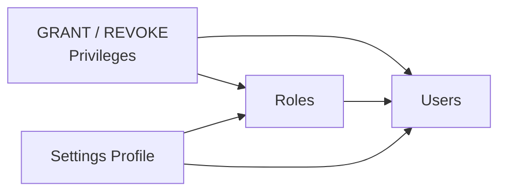
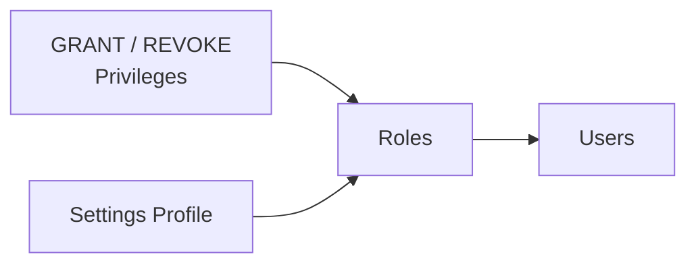
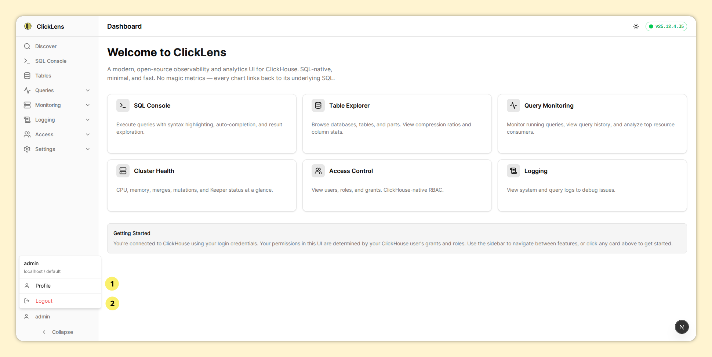
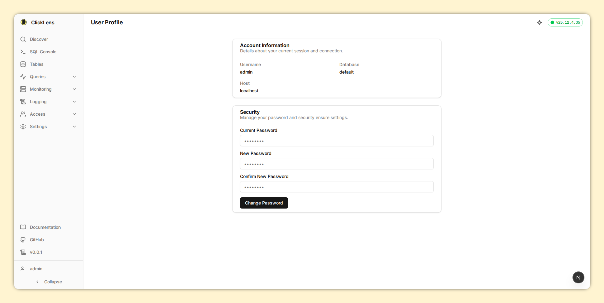

# Features

ClickLens provides a comprehensive suite of tools for managing and monitoring ClickHouse databases. This guide covers all major features and how to use them.

import { Callout } from "nextra/components";

## 1. Discover (Kibana-like Data Exploration)

The **Discover** feature provides a flexible, Kibana-style interface for exploring data in any ClickHouse table—not just logs.

<Callout type="info">
  **Requires `canDiscover` permission.** This permission is derived from having
  `SHOW TABLES` and `SELECT` access on at least one table.
</Callout>


### 1.1. Key Components

#### Database & Table Selection

Use the dropdowns in the header to select your data source:
- **Database Selector**: Choose from available databases
- **Table Selector**: Shows tables with their engine type (e.g., MergeTree, ReplicatedMergeTree)

#### Fields Sidebar

The left sidebar controls which columns appear in your query:
- **Search**: Filter columns by name
- **Select All / None**: Quick selection toggles
- **Time Column Picker**: Choose which DateTime column to use for time filtering
- **Type Icons**: Visual indicators for column types (DateTime, String, Number, Boolean)

<Callout type="warning">
  Only selected columns are included in the `SELECT` clause. This affects both
  the data grid and query performance.
</Callout>

#### Query Bar

Enter custom ClickHouse `WHERE` clause expressions:

```sql
level = 'Error'
status >= 400
host LIKE '%api%'
message ILIKE '%timeout%'
level IN ('Error', 'Fatal')
```

Features:
- **Query History**: Persisted in localStorage (up to 20 entries)
- **Syntax Help**: Hover over the help icon for examples
- **Execute**: Press Enter or click Search

#### Time Range Selector

Filter data by time using presets:
- Minutes: 5m, 15m, 30m
- Hours: 1h, 3h, 6h, 12h, 24h
- Days: 3d, 7d

#### Histogram

When a time column is selected, a bar chart shows document distribution over time:
- **Click a bar** to zoom into that time range
- **Reset Zoom** button to return to the selected preset

#### Results Grid

- **Row Count**: Shows "X of Y hits"
- **Row Detail**: Click any row to see all fields in a slide-out panel
- **Load More**: Offset-based pagination for large result sets


### 1.2. Query Syntax Guide

**Basic Filters**
```
column = value
column > 100
column LIKE '%pattern%'
column IN (1, 2, 3)
column BETWEEN 1 AND 100
column IS NULL
```

**Complex Filters**
```
column1 = value1 AND column2 > 100
column1 = value1 OR column2 = value2
NOT column = value
(column1 = value1 OR column2 = value2) AND column3 > 100
```

**Time Filters**
```
event_time >= '2024-01-01'
event_time BETWEEN '2024-01-01' AND '2024-01-31'
event_time >= toDateTime64(1704067200, 3)
```

**Order By Syntax**
```
column:asc
column:desc
column1:desc,column2:asc
```

**Group By Syntax**
```
column
column1,column2
```

### 1.3. Performance & Security

**Performance Optimizations**:
- Progressive time windows based on date range
- Row windowing (50 rows buffer) to prevent memory issues
- Parallel chunk queries (max 3 concurrent)
- Query caching for repeated queries
- Adaptive histogram height (100px-250px)

**Security Features**:
- SQL injection protection (blocks dangerous operations)
- Query timeout enforcement (default 60s, max 300s)
- Rate limiting (10 queries per minute per user)
- Full RBAC compatibility

### 1.4. Troubleshooting

**Query Timeout**: Add more specific filters, use time range filtering, select fewer columns

**Rate Limit Exceeded**: Wait a minute, use query caching, contact admin to increase limit

**SQL Validation Error**: Remove dangerous keywords, use only SELECT-compatible syntax

**Slow Query Performance**: Add time filters, reduce limit, select fewer columns, use GROUP BY

**No Results Returned**: Check database/table, verify time range, check filter conditions, ensure RBAC access

---

## 2. SQL Console

A full-featured SQL editor for writing and executing ClickHouse queries.

<Callout type="info">
  **Requires `canExecuteQueries` permission.** This is derived from having
  `SELECT` access on at least one database.
</Callout>


### 2.1. Key Features

#### Multi-Tab Support

- Open multiple query tabs simultaneously
- Tabs are persisted locally (SQL content survives browser refresh)
- Each tab maintains its own result set and history

#### SQL Editor

Built on CodeMirror 6 with ClickHouse-specific enhancements:
- **Syntax Highlighting**: Keywords, functions, strings, numbers
- **Context-Aware Autocomplete**:
  - Keywords after `FROM`, `JOIN` → table suggestions
  - After `USE`, `DATABASE` → database suggestions
  - After table reference → column suggestions (async fetch)
  - Built-in functions and keywords
- **Code Actions**: Execute, Explain, Format


#### Execution Modes

| Shortcut | Action |
| -------- | ------ |
| `Ctrl+Enter` | Execute all statements in the editor |
| `Ctrl+Shift+Enter` | Execute only the statement at cursor position |

#### Query Streaming

Large result sets are streamed to the UI using NDJSON:
- Progress indicator shows rows being fetched
- Results appear incrementally
- Cancel running queries with the Stop button

#### Explain Queries

Use the Explain dropdown to analyze query plans:
- **AST**: Abstract Syntax Tree
- **SYNTAX**: Normalized query syntax
- **PLAN**: Query execution plan
- **PIPELINE**: Processing pipeline visualization

#### Saved Queries

Save frequently-used queries for quick access:
- Click the Save icon to store a query
- Access saved queries from the Bookmarks panel
- Queries are stored server-side

#### Query History

The History panel shows recent executions with:
- SQL text
- Duration
- Rows returned / read
- Bytes read
- Memory usage
- User who ran it
- Errors (if any)


#### Time Range Insertion

Use the Time Range Selector to quickly insert time filter clauses into your SQL, properly handling the `WHERE` vs `AND` syntax.


#### Table Preview

Click the table name in the sidebar to navigate to the table's structure and data (first 100 rows).


### 2.2. Performance & Security

**Performance Optimizations**:
- Query timeout enforcement (max 5 minutes)
- NDJSON streaming for large result sets
- Pagination to reduce memory usage
- Metadata caching for table schemas
- Query performance metrics display

**Security Features**:
- SQL injection protection (blocks dangerous operations)
- Blocks dangerous table functions (file, url, remote, s3, etc.)
- Allows only read operations (SELECT, WITH, SHOW, DESCRIBE, EXPLAIN, etc.)
- Query rate limiting (60 queries per 60 seconds)
- Full RBAC enforcement

---

## 3. Table Explorer

Browse and inspect your ClickHouse schema in detail.

<Callout type="info">
  **Requires `canBrowseTables` permission.** This is derived from having `SHOW
  TABLES` grant.
</Callout>

### 3.1. Navigation

1. Select a database from the left sidebar
2. Click a table to view its details
3. Use the tabs to explore different aspects

### 3.2. Table Detail Tabs

| Tab | Description |
| --- | ----------- |
| **Overview** | Summary statistics (rows, size, engine) |
| **Columns** | Column definitions with types and defaults |
| **Parts** | Data parts with sizes and row counts |
| **Merges** | Active merge operations |
| **Mutations** | Pending ALTER mutations |
| **Replicas** | Replication status (for replicated tables) |
| **Dependencies** | Interactive graph of table relationships |
| **DDL** | `CREATE TABLE` statement |


### 3.3. Dependencies Graph

The **Dependencies** tab visualizes relationships between tables as an interactive graph. This helps understand data flow between tables, especially for:

- **Materialized Views** - Shows source tables that feed into the view
- **Views** - Shows tables referenced in the view definition
- **Distributed Tables** - Shows underlying local tables

Features:
- **Interactive Graph**: Pan, zoom, and explore the dependency tree
- **Visual Node Types**: Different colors and icons for table types
- **Hierarchical Layout**: Source tables appear at the top, dependent tables flow downward
- **MiniMap**: Navigate large graphs easily
- **Connected Highlighting**: When a table is selected, its dependencies are highlighted

<Callout type="info">
  Only tables with dependencies are shown in the graph. Isolated tables without
  any relationships are filtered out for clarity.
</Callout>

### 3.4. Performance Optimizations

- **Redis Caching**: All table data cached with stale-while-revalidate strategy
- **HTTP Caching**: Cache-Control headers enable browser and CDN caching
- **Metadata Caching**: Table schemas and column information cached
- **Skeleton Loaders**: Smooth loading experience without data flashing

---

## 4. Monitoring

Real-time cluster health and performance monitoring.

<Callout type="info">
  **Requires `canViewCluster` permission.** This is derived from having `SELECT`
  on system cluster tables.
</Callout>

### 4.1. Available Tabs

| Tab | Route | Description |
| --- | ----- | ----------- |
| **Overview** | `/monitoring/overview` | Dashboard with key metrics |
| **Metrics** | `/monitoring/metrics` | Browse `system.metrics` |
| **Cluster** | `/monitoring/cluster` | Cluster topology and nodes |
| **Health** | `/monitoring/health` | Health check status |
| **Disks** | `/monitoring/disks` | Disk usage and capacity |
| **Keeper** | `/monitoring/keeper` | ClickHouse Keeper status |
| **Operations** | `/monitoring/operations` | Active merges and mutations |
| **Replication** | `/monitoring/replication` | Replication queue status |


- **Cluster Status**: Shows the number of shards, replicas, and cluster name
- **Health Checks**: Uptime, readonly replicas, parts to check, max parts per partition, active queries, memory usage, and replication delay
- **Multiple Graphs**: Based on ClickHouse built-in monitoring dashboards, grouped into ClickHouse Metrics, System Health, and Network Metrics


> Because the demo cluster does not include ClickHouse Keeper/ZooKeeper, the screenshots show errors. This is expected behavior.


### 4.2. Performance Optimizations

- **Redis Caching**: All monitoring metrics cached with stale-while-revalidate
- **HTTP Caching**: Cache-Control headers enable browser and CDN caching
- **Skeleton Loaders**: Smooth loading experience without data flashing
- **Efficient Queries**: Optimized queries for system tables to minimize overhead

---

## 5. Query Analytics

Analyze query performance and identify slow queries.

<Callout type="info">
  **Requires `canViewProcesses` permission.** This is derived from having
  `SELECT` on `system.processes`.
</Callout>

### 5.1. Available Views

| View | Route | Description |
| ---- | ----- | ----------- |
| **Running** | `/queries/running` | Currently executing queries |
| **History** | `/queries/history` | Historical query log from `system.query_log` |
| **Analytics** | `/queries/analytics` | Top resource-consuming queries |
| **Cache** | `/queries/cache` | Query cache statistics |


- **Filter by user**: Filters queries executed by a specific user
- **Filter by execution duration**: Enter a minimum duration to show only queries that took longer
- **Filter by query type**: Filter by query type (INSERT, CREATE, SELECT, ALTER, DROP)
- **Filter by status**: Filter by execution status ('Success' or 'Error')

### 5.2. Query Cancellation


- **Refresh Control**: Control the refresh behavior (similar to Grafana and Kibana)
- **Kill action**: Kill queries using the KILL QUERY command (requires `canKillQueries` permission)

---

## 6. Logging

View and search through ClickHouse logs.

<Callout type="info">
  Different log types require different permissions.
</Callout>

| Log Type | Route | Required Permission |
| -------- | ----- | ------------------- |
| **Server Logs** | `/logging/server` | `canViewServerLogs` |
| **Session Logs** | `/logging/session` | `canViewSessionLogs` |
| **Crash Logs** | `/logging/crash` | `canViewCrashLogs` |


- **Time range**: Select the time range for logs
- **Filter by log level**: Filter to show only specific log levels (e.g., ERROR)
- **Filter by component**: Enter a component name to filter logs
- **Filter by message**: Enter part of a message to search (uses `WHERE LIKE '%string%'`)
- **Live Mode**: Auto-refresh uses efficient streaming to prepend only new logs

> The system.crash_log table does not exist in the database by default, it is created only when fatal errors occur.


---

## 7. Access Control

Manage ClickHouse users and roles.

<Callout type="info">
  **Requires `canManageUsers` permission.** This is derived from having `ACCESS
  MANAGEMENT` grant.
</Callout>

### 7.1. RBAC Overview

In ClickHouse, Access control management is supported via RBAC approach. The entities that are part of ClickHouse RBAC are:

- **User Account** – Identifies individual end users or applications that connect and access data in ClickHouse
- **Role** – Roles hold the information about privileges, settings, and constraints for the users
- **Settings profile** – Group of settings that will be applied to the user or a role
- **Quotas** – Limit the resource usage for a role or user over a period of time


```mermaid
flowchart LR
    GRANT[GRANT / REVOKE<br/>Privileges]
    ROLES[Roles]
    SETTINGS[Settings Profile]
    USERS[Users]

    GRANT --> USERS
    GRANT --> ROLES
    ROLES --> USERS
    SETTINGS --> USERS
    SETTINGS --> ROLES
```

ClickLens enforces a strict RBAC approach to ensure consistency and the Principle of Least Privilege:

- Grant only roles to users
- Grant privileges and settings profiles to roles


```mermaid
flowchart LR
    GRANT[GRANT / REVOKE<br/>Privileges]
    ROLES[Roles]
    SETTINGS[Settings Profile]
    USERS[Users]

    GRANT --> ROLES
    ROLES --> USERS
    SETTINGS --> ROLES
```

<Callout type="info">
  The **principle of least privilege** is an information security concept that
  states that every entity must be able to access only the information and
  resources that are necessary for completing the required task.
</Callout>

<Callout type="info">
  **XML-Configured Users (e.g., default user):** Some users receive access via
  `users.xml` instead of SQL grants. Since these privileges don't appear in
  `system.grants`, ClickLens intelligently falls back to user-credential probes
  (running `SHOW GRANTS` and probing `system.tables` with the user's
  credentials) to accurately determine access.
</Callout>

### 7.2. Available Views

| View | Route | Description |
| ---- | ----- | ----------- |
| **Users** | `/access/users` | List and manage database users |
| **Roles** | `/access/roles` | Manage roles and their grants |

View all ClickHouse users:


Create/Edit user and grant role(s):


View roles. There are two types of roles:


- **Feature roles**: System-managed roles that enable UI features. These are read-only and can be viewed by clicking on each role.


- **Custom roles**: User-created roles containing two types of permissions: inherited roles and data privileges. This allows for flexible role configuration.


---

## 8. Settings

View ClickHouse server and session settings.

<Callout type="info">
  **Requires `canViewSettings` permission.** This is derived from having
  `SELECT` on `system.settings`.
</Callout>

### 8.1. Available Views

| View | Route | Description |
| ---- | ----- | ----------- |
| **Server Settings** | `/settings/server` | Read from `system.server_settings`, contains information about global settings for the server, which are specified in `config.xml` |
| **Session Settings** | `/settings/session` | Read from `system.settings`, contains information about session settings for current user |


---

## 9. Profile

Users can view their information and change the password.



